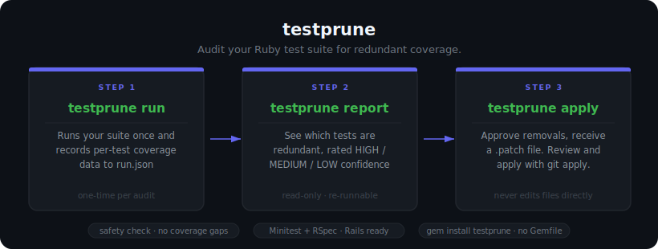
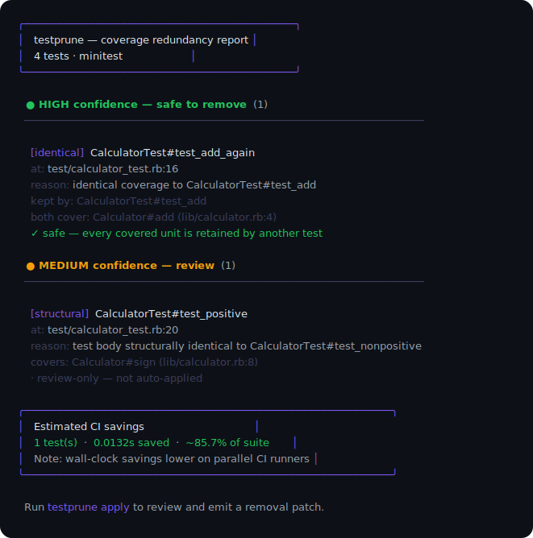

# testprune

> Find and remove redundant tests without opening coverage gaps.

<div align="center">



</div>

```sh
gem install testprune   # no Gemfile change required

testprune scan          # runs your suite once, records per-test coverage
testprune report        # see what's redundant — read-only
testprune apply         # approve removals → .patch file → git apply

# or all at once:
testprune prune         # scan + apply in a single step
```

Works with **Minitest** and **RSpec**. No config files. No changes to your project required.

---

## What it finds

| Type | Confidence | Auto-patch? | Description |
|------|-----------|-------------|-------------|
| Identical footprint | **HIGH** | ✅ | Two tests execute the exact same set of methods/branches. Keep one. |
| Subset / subsumed | **HIGH** | ✅ | Test A's footprint is a strict subset of test B's. A adds no unique coverage. |
| Structural duplicate | **MEDIUM** | ❌ review only | Prism-normalized test bodies match; footprints overlap. Human call. |
| High overlap (non-subset) | **LOW** | ❌ review only | Jaccard ≥ 0.9 but neither strictly subsumes the other. Flagged for review. |

**Locality gate:** cross-file identical/subset coverage is demoted to LOW — two tests in different files that both hit the same 3-line guard are testing different things and are never auto-removed.

---

## Installation

### Option A — standalone (recommended for a one-time audit)

```sh
gem install testprune
```

testprune puts itself on the subprocess load path automatically — no Gemfile change is needed.

### Option B — in-project (for recurring use / CI)

```ruby
# Gemfile
group :development do
  gem 'testprune', require: false
end
```

```sh
bundle install
bundle exec testprune scan
```

---

## Usage

### Step 1 — Capture

```sh
# No args: autodetects framework; prompts to exclude slow/integration folders
# (any test/ subdirectory matching: selenium, request, piper, integration)
testprune scan

# Positional paths — no `--` needed
testprune scan test/api test/services test/models
testprune scan test/models test/jobs -s app -s lib

# Explicit command (pass after --)
testprune scan -- bundle exec rspec spec/models
testprune scan -- bundle exec ruby -Itest test/my_test.rb
testprune scan -- bundle exec rails test test/controllers/

# Restrict which source files are analyzed (-s is repeatable)
testprune scan -s app -s lib -s packs

# Show raw test output (disables the progress display)
testprune scan --verbose        # or -V
```

By default, `testprune scan` suppresses raw test runner output and shows a live progress display (spinner + test counter + elapsed time). If test errors occur they are flagged non-blocking — the scan completes and you're prompted to expand the error detail before continuing.

Pass `--verbose` / `-V` to stream raw output directly instead (the pre-0.4.0 behavior).

When run with no arguments, `testprune scan` checks your `test/` directory and flags any subdirectories whose names contain `selenium`, `request`, `piper`, or `integration` — folders that tend to be slow, browser-driven, or external and are generally poor candidates for coverage analysis. You'll be prompted to exclude them before the run starts:

```
testprune: found folders that may be slow or integration-heavy:
  test/integration
  test/selenium
Include them in this run? [y/N]:
```

Answering `N` (the default) scopes the run to the remaining folders using `rails test`. Answering `y` proceeds with the normal autodetected command.

Writes `tmp/.testprune/run.json` — per-test coverage deltas and wall times. This is the only step that boots your suite.

### One-step workflow

```sh
testprune prune          # scan + apply in sequence — boots suite, then prompts for approval
testprune prune test/models test/jobs -s app -s lib
testprune prune -- bundle exec rails test test/models/
```

`prune` runs `scan` to capture coverage data, then immediately runs `apply` — which prints the report and prompts before writing any patch. Use this when you want the full workflow without running three separate commands.

### Step 2 — Report

```sh
testprune report              # grouped human-readable output
testprune report --json       # machine-readable (for CI dashboards)
testprune report -s app -s lib
```

**Example output** (against the bundled calculator fixture). In an interactive terminal the report is colorized and boxed via lipgloss:



<details>
<summary>Plain-text (<code>NO_COLOR</code>) version</summary>

```
  testprune — coverage redundancy report
  4 tests · minitest
────────────────────────────────────────────────────────────────

  ● HIGH confidence — safe to remove  (1)
  ──────────────────────────────────────────────────────────────

    [identical]  CalculatorTest#test_add_again
    at: test/calculator_test.rb:16
    reason: identical coverage to CalculatorTest#test_add
    kept by: CalculatorTest#test_add
    both cover: Calculator#add (lib/calculator.rb:4)
    ✓ safe — every covered unit is retained by another test

  ● MEDIUM confidence — review  (1)
  ──────────────────────────────────────────────────────────────

    [structural]  CalculatorTest#test_positive
    at: test/calculator_test.rb:20
    reason: test body structurally identical to CalculatorTest#test_nonpositive
    covers: Calculator#sign (lib/calculator.rb:8)
    · review-only — not auto-applied

  Estimated CI savings
  1 test(s)  ·  0.0132s saved  ·  ~85.7% of suite
  Note: wall-clock savings lower on parallel CI runners

  Run testprune apply to review and emit a removal patch.
```

</details>

### Step 3 — Apply

```sh
testprune apply
```

The tool reprints the full report, then prompts:

```
Apply 1 HIGH-confidence, safety-verified removal(s) as a patch?
(MEDIUM/LOW review-only candidates are NOT patched automatically.) [y/N]
```

Answering `y` writes `tmp/.testprune/removal.patch`. **No files are modified yet.**

```sh
git apply --check tmp/.testprune/removal.patch   # dry-run first
git apply tmp/.testprune/removal.patch
```

Removed tests are **commented out** (not deleted) with a reason annotation — you can delete or restore the commented block at your discretion:

```diff
-  def test_add_again
-    assert_equal 5, @calc.add(2, 3)
-  end
+  # testprune: removed redundant test — identical coverage to CalculatorTest#test_add
+#   def test_add_again
+#     assert_equal 5, @calc.add(2, 3)
+#   end
```

---

<details>
<summary>How it works — pipeline, confidence levels, safety guarantee, baseline subtraction</summary>

## How the pipeline works

```
  Your test suite
       │
       ▼
┌─────────────────────────────────────────────────────────────────────┐
│  CAPTURE   (testprune scan)                                         │
│                                                                     │
│  Coverage.setup(lines:, branches:, methods:)                        │
│       │                                                             │
│       ▼                                                             │
│  ┌──────────┐  peek_result   ┌──────────────────┐  peek_result     │
│  │  before  │ ─────────────► │   your test runs  │ ─────────────►  │
│  │ snapshot │                │  (one at a time)  │  after snapshot  │
│  └──────────┘                └──────────────────┘                  │
│                                       │                             │
│                      delta = after − before                         │
│                      (lines/branches/methods whose count rose)      │
│                                       │                             │
│                                       ▼                             │
│                              tmp/.testprune/run.json                │
│                              per-test coverage + wall time          │
└─────────────────────────────────────────────────────────────────────┘
       │
       ▼
┌─────────────────────────────────────────────────────────────────────┐
│  ANALYZE   (testprune report / apply)                               │
│                                                                     │
│  Prism AST parse of each source file                                │
│       │                                                             │
│       ▼                                                             │
│  Coverage locations ──► Semantic units                              │
│  (line 42, col 4)        "Calculator#add"                           │
│  ([if, 1, 10, 4, …])     "if then-branch (lib/x.rb:10)"            │
│                                                                     │
│       │                                                             │
│       ▼                                                             │
│  Per-test footprint = Set of semantic unit IDs                      │
│                                                                     │
│       │                                                             │
│       ▼                                                             │
│  Baseline subtraction: units in ≥50% of tests are ambient noise;   │
│  stripped before comparison so shared fixtures don't mask signal    │
│                                                                     │
│       │                                                             │
│       ▼                                                             │
│  ┌──────────────┐  ┌─────────────────┐  ┌──────────────────────┐   │
│  │  Identical   │  │ Subset/Subsumed │  │ Structural / Overlap │   │
│  │  footprint   │  │  (A ⊊ B)        │  │ (Prism body hash /   │   │
│  │  cluster     │  │                 │  │  Jaccard ≥ 0.9)      │   │
│  │  HIGH ✓      │  │  HIGH ✓         │  │  MEDIUM / LOW ○      │   │
│  └──────────────┘  └─────────────────┘  └──────────────────────┘   │
│                                                                     │
│       │                                                             │
│       ▼                                                             │
│  Coverage-safety check (cascading)                                  │
│  ─ For each HIGH candidate, verify every unit it covers             │
│    still has cover_count ≥ 2 among retained tests                   │
│  ─ Decrement counts as each removal is approved                     │
│  ─ Jointly-unsafe pairs: only one is approved                       │
│                                                                     │
│       │                                                             │
│       ▼                                                             │
│  Grouped report + estimated CI savings                              │
└─────────────────────────────────────────────────────────────────────┘
       │
       ▼
┌─────────────────────────────────────────────────────────────────────┐
│  PATCH   (testprune apply)                                          │
│                                                                     │
│  Human reviews the report, answers y/N                              │
│                                                                     │
│  Prism locates each approved test's AST block by line               │
│  ─ Comments it out with a reason annotation                         │
│  ─ Diffs via git diff --no-index                                    │
│  ─ Writes tmp/.testprune/removal.patch                              │
│                                                                     │
│  You: git apply tmp/.testprune/removal.patch                        │
│       review the commented-out tests                                │
│       delete or restore as you see fit                              │
└─────────────────────────────────────────────────────────────────────┘
```

## Understanding confidence levels

### HIGH — auto-patch eligible

```
CalculatorTest#test_add_again
  identical coverage to CalculatorTest#test_add
  covers: Calculator#add (lib/calculator.rb:4)
  ✓ safe — every covered unit remains covered by a retained test
```

Both tests execute `Calculator#add` and nothing else distinctive. After the
baseline strips shared setup, their footprints are byte-identical.
`test_add` is kept; `test_add_again` is the candidate.

**Still a human judgment call.** Coverage measures execution, not assertion
strength. `test_add_again` asserts `5` where `test_add` asserts `3`. If testing
both values of `add` is important to you, keep both. The `✓ safe` line only
guarantees no code path goes uncovered — it says nothing about assertion quality.

### MEDIUM — review only (never auto-patched)

```
CalculatorTest#test_positive
  test body structurally identical to CalculatorTest#test_nonpositive
  covers: Calculator#classify; if then-branch
  · review-only — not auto-applied
```

The Prism-normalized bodies match (same call sequence, different literals), but
`test_positive` and `test_nonpositive` hit *opposite* branch arms. testprune
flags the structural similarity but refuses to auto-patch because the footprints
differ. Human decision: are both branch arms tested elsewhere?

### LOW — review only

High-Jaccard-overlap pairs (≥90%) that are not strict subsets. Often means two
tests share a large Rails fixture setup but test genuinely different behavior.
Always review-only.

## The safety guarantee

> No semantic unit's coverage ever drops to zero as a result of a recommended removal.

It is **cascading-aware**: if tests A and B both cover unit `:x` exclusively,
proposing to remove both would uncover `:x`. The check evaluates candidates in
sorted order, decrementing `cover_count` as each removal is confirmed — so the
second removal fails the check (`cover_count[:x]` is now 1, not ≥ 2) and is
marked `✗ NOT safe (kept)`.

The same guarantee covers **ambient units** (those stripped by baseline
subtraction): cover_count is tracked against the original, unstripped footprints
so shared-setup units are protected even when they're invisible to the detector.

## Baseline subtraction

Large suites accumulate shared-setup coverage that makes unrelated tests look
identical. Example: a `User` fixture fires the same 12 callbacks in every test.
Without filtering, those 12 units appear in hundreds of footprints, creating
false "identical" clusters.

**Baseline** strips units executed by ≥ FRAC of tests before detection:

```sh
testprune report --baseline 0.5   # default: 50% threshold
testprune report --baseline 0.3   # more aggressive: 30%
testprune report --baseline 0     # disabled: trust raw coverage
```

The report discloses what was stripped:

```
Baseline: subtracted 847 shared-setup unit(s);
          23 test(s) had no distinctive coverage and were set aside.
```

A test with zero distinctive coverage after stripping is **never proposed for
removal** — testprune can't tell what it uniquely exercises.

</details>

<details>
<summary>Team playbook — Rails, Spring, SimpleCov, version managers, monorepo</summary>

### Minitest project (standard layout)

```sh
testprune scan -s app -s lib
testprune report -s app -s lib
testprune apply -s app -s lib

# or all at once:
testprune prune -s app -s lib
```

### RSpec project

```sh
testprune scan -s app -s lib -- bundle exec rspec
testprune report -s app -s lib
```

### Rails app

```sh
# Scan with no args — testprune will prompt to exclude selenium/integration folders
testprune scan -s app -s lib

# Scope to specific directories (positional args, no -- needed)
testprune scan -s app -s lib test/models
testprune scan -s app -s lib test/models test/jobs test/services

# Explicit command if you need full control
testprune scan -s app -s lib -s packs -- bundle exec rails test test/models/

# Full workflow in one step
testprune prune -s app -s lib test/models test/jobs
```

> **Note:** `run.json` is overwritten on each `testprune scan`. Run report/apply after each capture pass.

### Rails app with Spring

Spring preloads your app but forks the test process — the forked child doesn't
inherit `RUBYOPT` where testprune's autostart lives. Disable it for the run:

```sh
DISABLE_SPRING=1 testprune scan -s app -s lib -- bundle exec rails test test/models/
```

### Projects using SimpleCov (or other coverage gems)

No changes needed. testprune starts `Coverage` first (via `RUBYOPT`) and keeps
it running before your test helper loads. SimpleCov 0.22.x (verified against
source) guards its `Coverage.start` call with `unless Coverage.running?` — since
testprune already started it, SimpleCov skips its own start and cooperates
automatically. SimpleCov's final `Coverage.result` call still gets the full line-coverage aggregate — testprune
only uses `peek_result` (non-destructive snapshots) and never calls
`Coverage.result` itself.

> **Older SimpleCov versions:** If SimpleCov crashes with `coverage measurement
> is already setup`, your version calls `Coverage.start` unconditionally. Add
> `require 'testprune/autostart'` as the very first line of your test_helper.rb
> (before any SimpleCov require) so testprune initializes Coverage first and
> SimpleCov finds it already running.

### Ruby version manager (rv, rbenv, asdf)

Version-manager shims strip `RUBYOPT` before the subprocess starts. Re-inject it
*after* the shim using `env`:

```sh
# rv
rv run --ruby 3.2 env RUBYOPT="-I$(gem contents testprune | grep autostart | xargs dirname | head -1)/.. -rtestprune/autostart" \
  bundle exec rake test

# Simpler: install testprune under the managed ruby so RUBYOPT is not needed
rv run --ruby 3.2 gem install testprune
rv run --ruby 3.2 bundle exec testprune scan
```

The easiest path is always to install testprune under the same Ruby that runs
your suite. If `TESTPRUNE_DEBUG=1 testprune scan` prints nothing from `[testprune-debug]`,
the autostart never loaded — this is the cause.

### Monorepo / packs

Run each pack separately and analyze with its source path:

```sh
# Capture one pack
testprune scan -s packs/tenancy/app -- \
  bundle exec rails test packs/tenancy/test/

# Report for that pack
testprune report -s packs/tenancy/app
testprune apply  -s packs/tenancy/app
```

</details>

<details>
<summary>CI integration</summary>

testprune is best run on-demand or on a scheduled basis, not on every push.
The run step is the slow one (it boots and runs your suite); report/apply are
fast (they read from run.json).

```yaml
# .github/workflows/testprune.yml — run weekly
name: testprune audit
on:
  schedule:
    - cron: '0 9 * * 1'   # Monday 9am
  workflow_dispatch:        # manual trigger

jobs:
  audit:
    runs-on: ubuntu-latest
    steps:
      - uses: actions/checkout@v4
      - uses: ruby/setup-ruby@v1
        with:
          ruby-version: '3.2'
          bundler-cache: true
      - run: gem install testprune
      - run: testprune scan -s app -s lib -- bundle exec rails test test/models/
      - run: testprune report -s app -s lib --json > testprune-report.json
      - uses: actions/upload-artifact@v4
        with:
          name: testprune-report
          path: |
            tmp/.testprune/run.json
            testprune-report.json
```

To gate a PR on the report without blocking it:

```sh
# Exit 0 always; leave actioning the findings to a human
testprune report -s app -s lib || true
```

</details>

<details>
<summary>All options and environment variables</summary>

| Flag | Default | Command | Description |
|------|---------|---------|-------------|
| `-s, --source PATH` | `app`, `lib` | all | Source dir to analyze. Repeatable. Coverage outside these paths is ignored. |
| `-o, --output DIR` | `tmp/.testprune` | all | Where `run.json` and `removal.patch` are written. |
| `--baseline FRAC` | `0.5` | report, apply | Strip units in ≥ FRAC of tests as shared-setup noise before detection. `0` disables. |
| `--json` | off | report | Emit machine-readable JSON instead of human text. |
| `-V, --verbose` | off | scan | Stream raw test output directly (disables progress display). |
| `-h, --help` | | all | Show help. |
| `-v, --version` | | | Print version. |

**Environment variables:**

| Variable | Effect |
|----------|--------|
| `TESTPRUNE_ROOT` | Set the project root (default: `Dir.pwd`). Set automatically by `testprune scan`. |
| `TESTPRUNE_SOURCE_PATHS` | Colon-separated source paths. Set automatically by `testprune scan`. |
| `TESTPRUNE_OUTPUT_DIR` | Output directory. Set automatically by `testprune scan`. |
| `TESTPRUNE_DEBUG` | Print adapter-load diagnostics (`[testprune-debug] autostart loaded in pid …`). Useful when capture produces no `run.json`. |
| `DISABLE_SPRING` | Disable Spring preloader so the test process inherits testprune's instrumentation. |
| `NO_COLOR` | Set to any value to disable all ANSI color output ([no-color.org](https://no-color.org/)). Styled output is also disabled automatically when stdout/stderr is not a TTY (e.g. piped output, CI without color support). |

</details>

<details>
<summary>Caveats, requirements, and development</summary>

## Caveats

**Coverage ≠ assertion strength.** A test can execute a code path without
asserting anything meaningful about it. testprune flags coverage-identical tests,
but two tests that run the same method while asserting different properties are
*both* meaningful. Always review HIGH candidates before applying the patch.

**Opposite branch arms are correctly preserved.** The Prism semantic mapping
means `test_positive` (hitting the `then` arm) and `test_nonpositive` (hitting
the `else` arm) are never flagged as duplicates — even though they call the same
method.

**CI savings are aggregate, not wall-clock.** Reported savings = sum of removed
tests' wall times. Under parallel runners, actual wall-clock savings will be
smaller (only the critical path matters).

**Per-test `peek_result` overhead.** Snapshotting coverage around each test adds
overhead. On very large suites (10k+ tests) this is noticeable but acceptable —
it's mitigated by restricting `--source` to the paths you care about.

**run.json is machine-local.** Coverage paths are absolute. Don't run
`testprune scan` on CI and `testprune report` on a laptop with a different home
directory — the paths won't match. Always run all three commands on the same
machine.

## Requirements

- **Ruby ≥ 3.2** — requires `Coverage.setup` + `Coverage.supported?(:branches)`.
  (`Coverage.setup` landed in 3.1; branch and method coverage in 3.0.)
- **Prism ≥ 1.0, < 3** — bundled with Ruby ≥ 3.3; declared as a dependency.
- No changes to the target project are required. testprune injects itself via
  `RUBYOPT` at run time.

## Development

```sh
git clone https://github.com/seth-macpherson/testprune
cd testprune
bundle install
rake test          # 32 tests
```

### Project layout

```
exe/testprune                 CLI entry point
lib/testprune/
  autostart.rb               Loaded via RUBYOPT; starts Coverage + installs adapter
  recorder.rb                Per-process singleton; brackets each test
  adapters/
    minitest.rb              before_setup / after_teardown hooks
    rspec.rb                 around(:each) + after(:suite)
  coverage_delta.rb          Diff two peek_result snapshots → footprint delta
  semantic_map.rb            Prism AST → semantic unit index for one file
  footprint.rb               SemanticIndex + Footprint struct
  baseline.rb                Ambient-unit detection (shared-setup noise filter)
  duplication_detector.rb    Identical / subset / structural / overlap detection
  safety_check.rb            Cascading cover_count guard
  analysis.rb                Orchestrates: load run.json → footprints → detect
  report.rb                  Human + JSON output
  savings_estimator.rb       Aggregate wall-time estimate
  patch_writer.rb            Prism-located test block → git diff patch
  cli.rb                     OptionParser command dispatch
  configuration.rb           Settings + env-var round-trip
  runner.rb                  Subprocess boot + RUBYOPT injection
test/
  fixtures/sample_minitest/  Minimal calculator project used in integration test
  testprune/
    baseline_test.rb
    duplication_detector_test.rb
    safety_check_test.rb
    semantic_map_test.rb
    coverage_delta_test.rb
  integration_test.rb        Full CLI end-to-end
```

</details>
